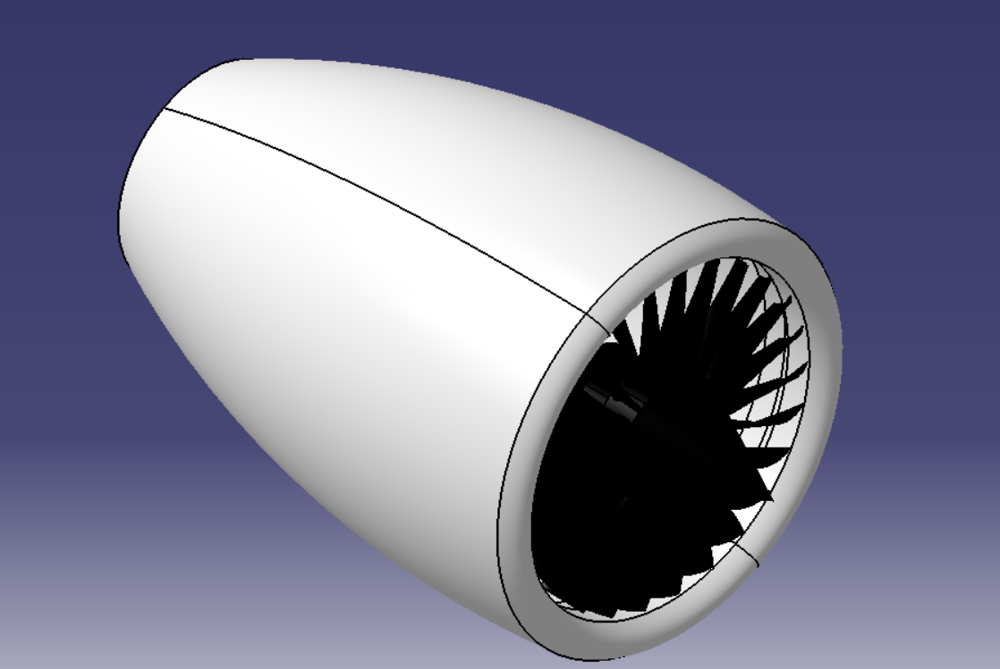

# Centrifugal Air Compressor — CATIA CAD Model

## 📌 Project Overview

A 3D CAD model of a centrifugal air compressor developed in **CATIA** as a mechanical design and modelling study.

The project focuses on developing the geometric representation of the compressor casing and internal rotating impeller assembly.

## 🎯 Objectives

- Develop a 3D CAD representation of a centrifugal air compressor.
- Understand the geometry and arrangement of major components.
- Apply CATIA part and assembly modelling concepts.
- Improve practical understanding of mechanical component modelling and engineering visualization.

## ⚙️ Model Features

The current model includes:

- Cylindrical compressor casing
- Radial-bladed impeller
- Central rotating assembly
- Casing/end geometry
- Assembly-level representation

## 🛠️ Software

**CATIA**

### CAD Skills Applied

- 3D Part Modelling
- Assembly Modelling
- Geometric Design
- Mechanical Component Modelling
- Engineering Visualization

## 📷 Model Preview

## 📌 Project Overview

A 3D CAD model of a centrifugal air compressor developed in **CATIA** as a mechanical design and modelling study.

The project focuses on developing the geometric representation of the compressor casing and internal rotating impeller assembly.

## 🎯 Objectives

- Develop a 3D CAD representation of a centrifugal air compressor.
- Understand the geometry and arrangement of major components.
- Apply CATIA part and assembly modelling concepts.
- Improve practical understanding of mechanical component modelling and engineering visualization.

## ⚙️ Model Features

The current model includes:

- Cylindrical compressor casing
- Radial-bladed impeller
- Central rotating assembly
- Casing/end geometry
- Assembly-level representation

## 🛠️ Software

**CATIA**

### CAD Skills Applied

- 3D Part Modelling
- Assembly Modelling
- Geometric Design
- Mechanical Component Modelling
- Engineering Visualization

## 📷 Model Preview

## 📚 Learning Outcomes

This project helped develop practical understanding of:

- Mechanical component geometry
- CATIA modelling workflow
- Assembly relationships
- Centrifugal compressor configuration
- Engineering visualization

## 🚧 Future Development

Possible future extensions include:

- Detailed component modelling
- Technical drawings and dimensions
- CFD analysis of airflow through the compressor
- Performance-related analysis
- Design refinement based on engineering calculations

## 📚 Learning Outcomes

This project helped develop practical understanding of:

- Mechanical component geometry
- CATIA modelling workflow
- Assembly relationships
- Centrifugal compressor configuration
- Engineering visualization

## 🚧 Future Development

Possible future extensions include:

- Detailed component modelling
- Technical drawings and dimensions
- CFD analysis of airflow through the compressor
- Performance-related analysis
- Design refinement based on engineering calculations
